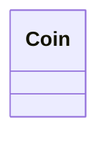

# Coin

<!-- sdd-knowledge-generated -->

## Overview

- **Files**: 6
- **Symbols**: 141

## Files

- `coin/coins_test.go`
- `coin/coins.go` — Coin, AssetID, String, AssetID, TokenAssetID, ptr, Ethereum, Classic, Icon, Cosmos, Ripple, Stellar, Poa, Tron, Fio, Nimiq, Iotex, Iotexevm, Zilliqa, Aion, Aeternity, Kava, Theta, Binance, Vechain, Callisto, Tomochain, Thundertoken, Ontology, Tezos, Kin, Nebulas, Gochain, Wanchain, Waves, Bitcoin, Litecoin, Doge, Dash, Viacoin, Groestlcoin, Zcash, Firo, Bitcoincash, Ravencoin, Qtum, Zelcash, Decred, Algorand, Nano, Digibyte, Harmony, Kusama, Polkadot, Solana, Near, Elrond, Smartchain, Filecoin, Oasis, Monacoin, Bitcoingold, Eos, Terra, Band, Neo, Cardano, Nuls, Polygon, Thorchain, Optimism, Xdai, Avalanchec, Heco, Fantom, Arbitrum, Celo, Ronin, Osmosis, Cronos, Kcc, Aurora, Kavaevm, Meter, Evmos, Nativeevmos, Okc, Cryptoorg, Aptos, Megaeth, Moonbeam, Klaytn, Metis, Moonriver, Boba, Ton, Polygonzkevm, Zksync, Sui, Stride, Neutron, Stargaze, Nativeinjective, Cfxevm, Acala, Acalaevm, Base, Akash, Agoric, Axelar, Juno, Sei, Seievm, Neon, Opbnb, Linea, Gbnb, Mantle, Manta, Zetachain, Zetaevm, Merlin, Blast, Scroll, Internet_computer, Bouncebit, Zklinknova, Sonic, Tia, Dydx, Plasma, Monad, Hyperevm, Robinhoodchain
- `coin/gen_test.go`
- `coin/gen.go` — Coin, main, getValidParameter
- `coin/models_test.go`
- `coin/models.go` — GetCoinForId, IsEVM, GetCoinExploreURL, GetAddressExploreURL

## Class Diagram

## External Dependencies

- `github.com`
- `golang.org`
- `gopkg.in`

## Minimum Viable Specification

> Auto-generated specification for the **Coin** feature.

**Key Types**: Coin, Coin

