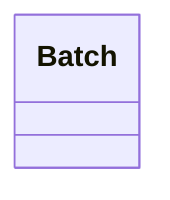

# Slice

<!-- sdd-knowledge-generated -->

## Overview

- **Files**: 2
- **Symbols**: 6

## Files

- `slice/batch_test.go`
- `slice/batch.go` — Batch, NewBatch, GetChunks, GetChunks, GetInterfaceSlice, GetInterfaceSliceBatch

## Class Diagram

## Minimum Viable Specification

> Auto-generated specification for the **Slice** feature.

**Key Types**: Batch

## See Also
- [god nodes](../architecture/god-nodes.md) <!-- rel:strong -->
- [call graph](../architecture/call-graph.md) <!-- rel:strong -->
- [domain overview](../architecture/domain-overview.md) <!-- rel:related -->
- [testing strategy](../tests/testing-strategy.md) <!-- rel:related -->
- [entities](../architecture/data/entities.md) <!-- rel:related -->
