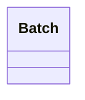

# Slice

<!-- sdd-knowledge-generated -->

## Overview

- **Files**: 2
- **Symbols**: 6

## Files

- `slice/batch_test.go`
- `slice/batch.go` — Batch, NewBatch, GetChunks, GetChunks, GetInterfaceSlice, GetInterfaceSliceBatch

## Class Diagram

## Minimum Viable Specification

> Auto-generated specification for the **Slice** feature.

**Key Types**: Batch

