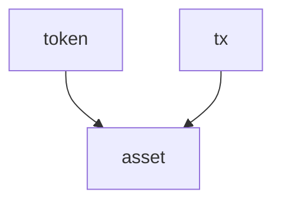

# Types

<!-- sdd-knowledge-generated -->

## Overview

- **Files**: 15
- **Symbols**: 80
- **DTOs**: SubscriptionEvent, TxOutput

## Files

- `types/asset.go` — Asset, GetAssetsIds
- `types/chain_test.go`
- `types/chain.go` — GetChainFromAssetType
- `types/chainid.go`
- `types/collectibles.go` — Collection, CollectionPage, CollectibleTransferFee, CollectibleMedia, Collectible, CollectibleProperty, CollectiblePage
- `types/marshal_test.go`
- `types/marshal.go` — wrappedTx, UnmarshalJSON, MarshalJSON, Len, Less, Swap
- `types/subscription_test.go`
- `types/subscription.go` — Subscriptions, SubscriptionOperation, SubscriptionEvent, Subscription, TransactionNotification, Subscriber, AddressID, GetAddressID, ParseSubscriptions
- `types/token_test.go`
- `types/token.go` — TokenType, TokenVersion, Token, GetTokenTypes, GetTokenType, GetTokenVersion, ParseTokenTypeFromString, GetEthereumTokenTypeByIndex, AssetId
- `types/tx_test.go`
- `types/tx.go` — Direction, Status, TransactionType, KeyType, KeyTitle, Amount, Block, TxPage, Tx, Fee, TxOutput, Transfer, TransferNFT, Swap, ContractCall, Txs, AssetHolder, Validator, NewTxPage, FilterUniqueID, CleanMemos, SortByBlockCreationTime, FilterTransactionsByType, GetAsset, Validate, GetAsset, Validate, GetAsset, Validate, GetAsset, cleanMemo, GetAddresses, GetSubscriptionAddresses, GetDirection, GetAssetID, determineTransactionDirection, IsUTXO, IsEVM, GetUTXOValueFor, InferDirection, IsTxTypeAmong
- `types/types_test.go`
- `types/types.go` — HexNumber, MarshalJSON, UnmarshalJSON, ToBig, HexNumberToUnix

## Architecture

### Layers

**Dto**: `SubscriptionEvent`, `TxOutput`

**Other**: `Asset`, `GetAssetsIds`, `GetChainFromAssetType`, `Collection`, `CollectionPage`, `CollectibleTransferFee`, `CollectibleMedia`, `Collectible`, `CollectibleProperty`, `CollectiblePage`, `wrappedTx`, `UnmarshalJSON`, `MarshalJSON`, `Len`, `Less`, `Swap`, `Subscriptions`, `SubscriptionOperation`, `Subscription`, `TransactionNotification`, `Subscriber`, `AddressID`, `GetAddressID`, `ParseSubscriptions`, `TokenType`, `TokenVersion`, `Token`, `GetTokenTypes`, `GetTokenType`, `GetTokenVersion`, `ParseTokenTypeFromString`, `GetEthereumTokenTypeByIndex`, `AssetId`, `Direction`, `Status`, `TransactionType`, `KeyType`, `KeyTitle`, `Amount`, `Block`, `TxPage`, `Tx`, `Fee`, `Transfer`, `TransferNFT`, `Swap`, `ContractCall`, `Txs`, `AssetHolder`, `Validator`, `NewTxPage`, `FilterUniqueID`, `CleanMemos`, `SortByBlockCreationTime`, `FilterTransactionsByType`, `GetAsset`, `Validate`, `GetAsset`, `Validate`, `GetAsset`, `Validate`, `GetAsset`, `cleanMemo`, `GetAddresses`, `GetSubscriptionAddresses`, `GetDirection`, `GetAssetID`, `determineTransactionDirection`, `IsUTXO`, `IsEVM`, `GetUTXOValueFor`, `InferDirection`, `IsTxTypeAmong`, `HexNumber`, `MarshalJSON`, `UnmarshalJSON`, `ToBig`, `HexNumberToUnix`

## Class Diagram

```mermaid
classDiagram
  class Asset {
  }
  class Collection {
  }
  class CollectibleTransferFee {
  }
  class CollectibleMedia {
  }
  class Collectible {
  }
  class CollectibleProperty {
  }
  class SubscriptionEvent {
    <<dto>>
  }
  class Subscription {
  }
  class TransactionNotification {
  }
  class Token {
  }
  class Block {
  }
  class TxPage {
  }
  class Tx {
  }
  class Fee {
  }
  class TxOutput {
    <<dto>>
  }
  class Transfer {
  }
  class TransferNFT {
  }
  class Swap {
  }
  class ContractCall {
  }
  class AssetHolder {
    <<interface>>
  }
  class Validator {
    <<interface>>
  }
```

## Internal Dependencies

## External Dependencies

- `github.com`

## Minimum Viable Specification

> Auto-generated specification for the **Types** feature.

**Contracts**: SubscriptionEvent, TxOutput

**Key Types**: Asset, Collection, CollectibleTransferFee, CollectibleMedia, Collectible, CollectibleProperty, SubscriptionEvent, Subscription, TransactionNotification, Token, Block, TxPage, Tx, Fee, TxOutput, Transfer, TransferNFT, Swap, ContractCall, AssetHolder, Validator

